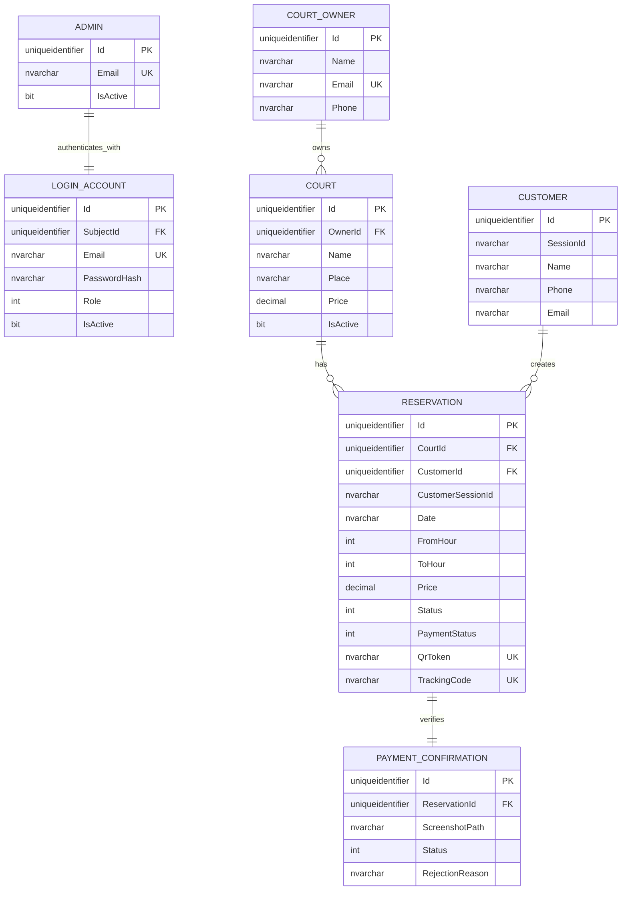

# Yalla Match ERD

```mermaid
erDiagram
    ADMIN {
        uniqueidentifier Id PK
        nvarchar Email UK
        bit IsActive
    }

    LOGIN_ACCOUNT {
        uniqueidentifier Id PK
        uniqueidentifier SubjectId FK
        nvarchar Email UK
        nvarchar PasswordHash
        int Role
        bit IsActive
    }

    COURT_OWNER {
        uniqueidentifier Id PK
        nvarchar Name
        nvarchar Email UK
        nvarchar Phone
    }

    COURT {
        uniqueidentifier Id PK
        uniqueidentifier OwnerId FK
        nvarchar Name
        nvarchar Place
        decimal Price
        bit IsActive
    }

    CUSTOMER {
        uniqueidentifier Id PK
        nvarchar SessionId
        nvarchar Name
        nvarchar Phone
        nvarchar Email
    }

    RESERVATION {
        uniqueidentifier Id PK
        uniqueidentifier CourtId FK
        uniqueidentifier CustomerId FK
        nvarchar CustomerSessionId
        nvarchar Date
        int FromHour
        int ToHour
        decimal Price
        int Status
        int PaymentStatus
        nvarchar QrToken UK
        nvarchar TrackingCode UK
    }

    PAYMENT_CONFIRMATION {
        uniqueidentifier Id PK
        uniqueidentifier ReservationId FK
        nvarchar ScreenshotPath
        int Status
        nvarchar RejectionReason
    }

    ADMIN ||--|| LOGIN_ACCOUNT : authenticates_with
    COURT_OWNER ||--o{ COURT : owns
    COURT ||--o{ RESERVATION : has
    CUSTOMER ||--o{ RESERVATION : creates
    RESERVATION ||--|| PAYMENT_CONFIRMATION : verifies
```

## Status Flow

1. `AwaitingPaymentScreenshot`
2. `PendingPaymentVerification`
3. `Confirmed`
4. `CheckedIn`

Rejected or cancelled reservations are excluded from slot blocking.
